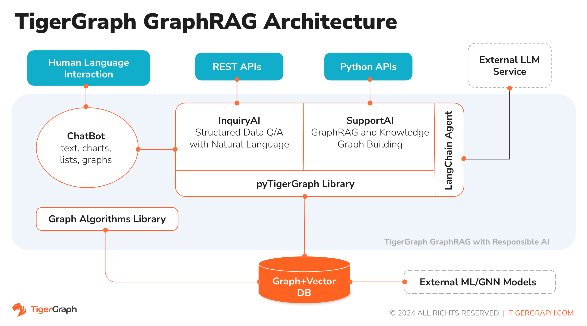
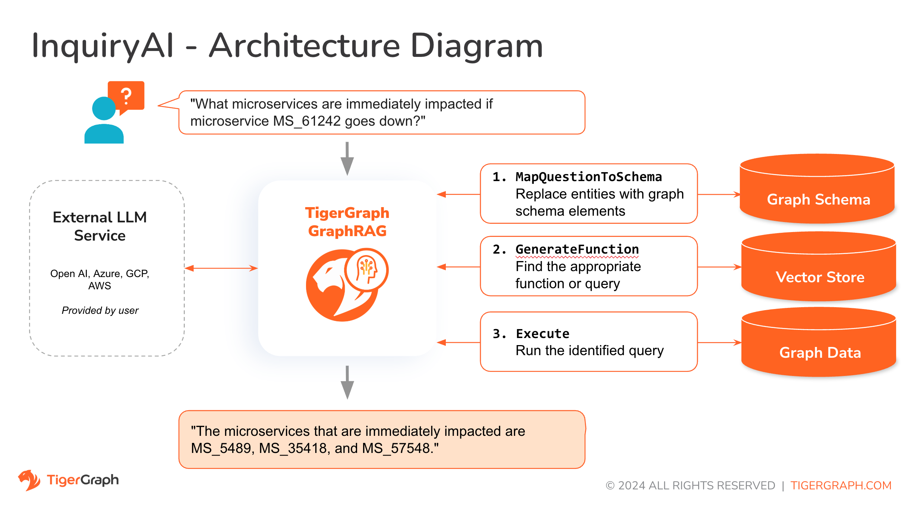
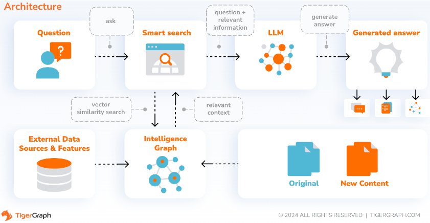

# TigerGraph GraphRAG

> ⚠️ **Disclaimer**  
> - **Supported Backend:** TigerGraph is the only Vector and Graph DB supported in this project. Hybrid Search is the officially retriever method supported at backend.  
> - **Limitations:** No official support is provided unless delivered through a Statement of Work (SOW) with the Solutions team. Customizations are customer-owned self-service to handle custom LLM service, prompt logic, UI integration, and pipeline orchestration. This project is provided "as is" without any warranties or guarantees.

## Releases
* **6/18/2025: GraphRAG is available now officially v1.0 (v1.0.0). Please see [Release Notes](https://docs.tigergraph.com/tg-graphrag/current/release-notes/) for details.

## Overview



TigerGraph GraphRAG is an AI assistant that is meticulously designed to combine the powers of vector store, graph databases and generative AI to draw the most value from data and to enhance productivity across various business functions, including analytics, development, and administration tasks. It is one AI assistant with three core component services:
* InquiryAI as a natural language assistant for graph-powered solutions
* SupportAI as a knowledge Q&A assistant for documents and graphs

You can interact with GraphRAG through the built-in chat interface and APIs. For now, your own LLM services (from OpenAI, Azure, GCP, AWS Bedrock, Ollama, Hugging Face and Groq.) are required to use GraphRAG, but in future releases you can use TigerGraph’s LLMs.

### InquiryAI


When a question is posed in natural language, GraphRAG (InquiryAI) employs a novel three-phase interaction with both the TigerGraph database and a LLM of the user's choice, to obtain accurate and relevant responses.

The first phase aligns the question with the particular data available in the database. GraphRAG uses the LLM to compare the question with the graph’s schema and replace entities in the question by graph elements. For example, if there is a vertex type of `BareMetalNode` and the user asks `How many servers are there?`, the question will be translated to `How many BareMetalNode vertices are there?`. In the second phase, GraphRAG uses the LLM to compare the transformed question with a set of curated database queries and functions in order to select the best match. In the third phase, GraphRAG executes the identified query and returns the result in natural language along with the reasoning behind the actions.

Using pre-approved queries provides multiple benefits. First and foremost, it reduces the likelihood of hallucinations, because the meaning and behavior of each query has been validated.  Second, the system has the potential of predicting the execution resources needed to answer the question.

### SupportAI


With SupportAI, GraphRAG creates chatbots with graph-augmented AI on a user's own documents or text data. It builds a knowledge graph from source material and applies its unique variant of knowledge graph-based RAG (Retrieval Augmented Generation) to improve the contextual relevance and accuracy of answers to natural-language questions.

GraphRAG will also identify concepts and build an ontology, to add semantics and reasoning to the knowledge graph, or users can provide their own concept ontology. Then, with this comprehensive knowledge graph, GraphRAG performs hybrid retrievals, combining traditional vector search and graph traversals, to collect more relevant information and richer context to answer users’ knowledge questions.

Organizing the data as a knowledge graph allows a chatbot to access accurate, fact-based information quickly and efficiently, thereby reducing the reliance on generating responses from patterns learned during training, which can sometimes be incorrect or out of date.


## Getting Started

### Self-Managed
The quickest way to access TigerGraph GraphRAG is to deploy its docker image with the docker compose file in the repo. In order to take this route, you will need the following prerequisites.

#### Prerequisites
* Docker
* TigerGraph DB 4.2+.
* API key of your LLM provider. (An LLM provider refers to a company or organization that offers Large Language Models (LLMs) as a service. The API key verifies the identity of the requester, ensuring that the request is coming from a registered and authorized user or application.) Currently, GraphRAG supports the following LLM providers: OpenAI, Azure OpenAI, GCP, AWS Bedrock.

#### Deploy with Docker Compose
* Step 1: Get docker-compose file
  - Download the [docker-compose.yml](https://raw.githubusercontent.com/tigergraph/ecosys/refs/heads/master/tutorials/graphrag/docker-compose.yml) file directly

  The Docker Compose file contains all dependencies for GraphRAG. Moreover, GraphRAG comes with a Swagger API documentation page when it is deployed. If you wish to disable it, you can set the `PRODUCTION` environment variable to true for the GraphRAG service in the Compose file.

* Step 2: Set up configurations

  Next, in the same directory as the Docker Compose file is in, create and fill in the following configuration files:
  * [configs/server_config.json](https://raw.githubusercontent.com/tigergraph/ecosys/refs/heads/master/tutorials/graphrag/configs/server_config.json)
  * [configs/nginx.conf](https://raw.githubusercontent.com/tigergraph/ecosys/refs/heads/master/tutorials/graphrag/configs/nginx.conf)

* Step 3 (Optional): Configure Logging Level in Dockerfile

To configure the logging level of the service, edit the Docker Compose file.

**By default, the logging level is set to "INFO".**

```console
ENV LOGLEVEL="INFO"
```

This line can be changed to support different logging levels.

**The levels are described below:**

| Level | Description |
| --- | --- |
| `CRITICAL` | A serious error. |
| `ERROR` | Failing to perform functions. |
| `WARNING` | Indication of unexpected problems, e.g. failure to map a user’s question to the graph schema. |
| `INFO` | Confirming that the service is performing as expected. |
| `DEBUG` | Detailed information, e.g. the functions retrieved during the `GenerateFunction` step, etc. |
| `DEBUG_PII` | Finer-grained information that could potentially include `PII`, such as a user’s question, the complete function call (with parameters), and the LLM’s natural language response. |
| NOTSET | All messages are processed. |


* Step 4: Start all services

  Uncomment `tigergraph` section from `docker-compose.yaml` if it's commented out. Please follow the [instructions](https://github.com/tigergraph/ecosys/blob/master/tutorials/GSQL.md#set-up-environment) to download TigerGraph docker image.

  Now, simply run `docker compose up -d` and wait for all the services to start.

> Note: `graphrag` container will be down if TigerGraph service is not ready. Log into the `tigergraph` container, bring up tigergraph services and rerun `docker compose up -d` should resolve the issue.

#### Configurations

##### LLM provider configuration
In the `llm_config` section of `configs/server_config.json` file, copy JSON config template from below for your LLM provider, and fill out the appropriate fields. Only one provider is needed.

* OpenAI
In addition to the `OPENAI_API_KEY`, `llm_model` and `model_name` can be edited to match your specific configuration details.

    ```json
    {
        "llm_config": {
            "embedding_service": {
                "embedding_model_service": "openai",
                "model_name": "text-embedding-3-small",
                "authentication_configuration": {
                    "OPENAI_API_KEY": "YOUR_OPENAI_API_KEY_HERE"
                }
            },
            "completion_service": {
                "llm_service": "openai",
                "llm_model": "gpt-4.1-mini",
                "authentication_configuration": {
                    "OPENAI_API_KEY": "YOUR_OPENAI_API_KEY_HERE"
                },
                "model_kwargs": {
                    "temperature": 0
                },
                "prompt_path": "./app/prompts/openai_gpt4/"
            }
        }
    }
    ```
* GCP

Follow the GCP authentication information found here: https://cloud.google.com/docs/authentication/application-default-credentials#GAC and create a Service Account with VertexAI credentials. Then add the following to the docker run command:

```sh
-v $(pwd)/configs/SERVICE_ACCOUNT_CREDS.json:/SERVICE_ACCOUNT_CREDS.json -e GOOGLE_APPLICATION_CREDENTIALS=/SERVICE_ACCOUNT_CREDS.json
```

And your JSON config should follow as:

    ```json
    {
        "llm_config": {
            "embedding_service": {
                "embedding_model_service": "vertexai",
                "model_name": "GCP-text-bison",
                "authentication_configuration": {}
            },
            "completion_service": {
                "llm_service": "vertexai",
                "llm_model": "text-bison",
                "model_kwargs": {
                    "temperature": 0
                },
                "prompt_path": "./app/prompts/gcp_vertexai_palm/"
            }
        }
    }
    ```

* Azure

In addition to the `AZURE_OPENAI_ENDPOINT`, `AZURE_OPENAI_API_KEY`, and `azure_deployment`, `llm_model` and `model_name` can be edited to match your specific configuration details.

    ```json
    {
        "llm_config": {
            "embedding_service": {
                "embedding_model_service": "azure",
                "model_name": "GPT35Turbo",
                "azure_deployment":"YOUR_EMBEDDING_DEPLOYMENT_HERE",
                "authentication_configuration": {
                    "OPENAI_API_TYPE": "azure",
                    "OPENAI_API_VERSION": "2022-12-01",
                    "AZURE_OPENAI_ENDPOINT": "YOUR_AZURE_ENDPOINT_HERE",
                    "AZURE_OPENAI_API_KEY": "YOUR_AZURE_API_KEY_HERE"
                }
            },
            "completion_service": {
                "llm_service": "azure",
                "azure_deployment": "YOUR_COMPLETION_DEPLOYMENT_HERE",
                "openai_api_version": "2023-07-01-preview",
                "llm_model": "gpt-35-turbo-instruct",
                "authentication_configuration": {
                    "OPENAI_API_TYPE": "azure",
                    "AZURE_OPENAI_ENDPOINT": "YOUR_AZURE_ENDPOINT_HERE",
                    "AZURE_OPENAI_API_KEY": "YOUR_AZURE_API_KEY_HERE"
                },
                "model_kwargs": {
                    "temperature": 0
                },
                "prompt_path": "./app/prompts/azure_open_ai_gpt35_turbo_instruct/"
            }
        }
    }
    ```

* AWS Bedrock
    ```json
    {
        "llm_config": {
            "embedding_service": {
                "embedding_model_service": "bedrock",
                "model_name":"amazon.titan-embed-text-v1",
                "authentication_configuration": {
                    "AWS_ACCESS_KEY_ID": "ACCESS_KEY",
                    "AWS_SECRET_ACCESS_KEY": "SECRET"
                }
            },
            "completion_service": {
                "llm_service": "bedrock",
                "llm_model": "anthropic.claude-3-haiku-20240307-v1:0",
                "authentication_configuration": {
                    "AWS_ACCESS_KEY_ID": "ACCESS_KEY",
                    "AWS_SECRET_ACCESS_KEY": "SECRET"
                },
                "model_kwargs": {
                    "temperature": 0,
                },
                "prompt_path": "./app/prompts/aws_bedrock_claude3haiku/"
            }
        }
    }
    ```

* Ollama
    ```json
    {
        "llm_config": {
            "embedding_service": {
                "embedding_model_service": "openai",
                "model_name": "GPT-4o",
                "authentication_configuration": {
                    "OPENAI_API_KEY": ""
                }
            },
            "completion_service": {
                "llm_service": "ollama",
                "llm_model": "calebfahlgren/natural-functions",
                "model_kwargs": {
                    "temperature": 0.0000001
                },
                "prompt_path": "./app/prompts/openai_gpt4/"
            }
        }
    }
    ```

* Hugging Face

Example configuration for a model on Hugging Face with a dedicated endpoint is shown below. Please specify your configuration details:\

    ```json
    {
        "llm_config": {
            "embedding_service": {
                "embedding_model_service": "openai",
                "model_name": "llama3-8b",
                "authentication_configuration": {
                    "OPENAI_API_KEY": ""
                }
            },
            "completion_service": {
                "llm_service": "huggingface",
                "llm_model": "hermes-2-pro-llama-3-8b-lpt",
                "endpoint_url": "https:endpoints.huggingface.cloud",
                "authentication_configuration": {
                    "HUGGINGFACEHUB_API_TOKEN": ""
                },
                "model_kwargs": {
                    "temperature": 0.1
                },
                "prompt_path": "./app/prompts/openai_gpt4/"
            }
        }
    }
    ```

Example configuration for a model on Hugging Face with a serverless endpoint is shown below. Please specify your configuration details:

    ```json
    {
        "llm_config": {
            "embedding_service": {
                "embedding_model_service": "openai",
                "model_name": "Llama3-70b",
                "authentication_configuration": {
                    "OPENAI_API_KEY": ""
                }
            },
            "completion_service": {
                "llm_service": "huggingface",
                "llm_model": "meta-llama/Meta-Llama-3-70B-Instruct",
                "authentication_configuration": {
                    "HUGGINGFACEHUB_API_TOKEN": ""
                },
                "model_kwargs": {
                    "temperature": 0.1
                },
                "prompt_path": "./app/prompts/llama_70b/"
            }
        }
    }
    ```

* Groq
    ```json
    {
        "llm_config": {
            "embedding_service": {
                "embedding_model_service": "openai",
                "model_name": "mixtral-8x7b-32768",
                "authentication_configuration": {
                    "OPENAI_API_KEY": ""
                }
            },
            "completion_service": {
                "llm_service": "groq",
                "llm_model": "mixtral-8x7b-32768",
                "authentication_configuration": {
                    "GROQ_API_KEY": ""
                },
                "model_kwargs": {
                    "temperature": 0.1
                },
                "prompt_path": "./app/prompts/openai_gpt4/"
            }
        }
    }
    ```

##### DB configuration
Copy the below into `configs/server_config.json` and edit the `hostname` and `getToken` fields to match your database's configuration. If token authentication is enabled in TigerGraph, set `getToken` to `true`. Set the timeout, memory threshold, and thread limit parameters as desired to control how much of the database's resources are consumed when answering a question.

    ```json
    {
        "db_config": {
            "hostname": "http://tigergraph",
            "restppPort": "9000",
            "gsPort": "14240",
            "getToken": false,
            "default_timeout": 300,
            "default_mem_threshold": 5000,
            "default_thread_limit": 8
        }
    }
    ```

##### GraphRAG configuration
Copy the below code into `configs/server_config.json`. You shouldn’t need to change anything unless you change the port of the chat history service in the Docker Compose file.

`reuse_embedding` to `true` will skip re-generating the embedding if it already exists.
`ecc` and `chat_history_api` are the addresses of internal components of GraphRAG.If you use the Docker Compose file as is, you don’t need to change them.

    ```json
    {
        "graphrag_config": {
            "reuse_embedding": false,
            "ecc": "http://eventual-consistency-service:8001",
            "chat_history_api": "http://chat-history:8002"
        }
    }


##### Chat configuration
Copy the below code into `configs/server_config.json`. You shouldn’t need to change anything unless you change the port of the chat history service in the Docker Compose file.

    ```json
    {
        "chat-history": {
            "apiPort":"8002",
            "dbPath": "chats.db",
            "dbLogPath": "db.log",
            "logPath": "requestLogs.jsonl",
            "conversationAccessRoles": ["superuser", "globaldesigner"]
        }
    }
```

##### Enable openCypher Query Generation in InquiryAI
If you would like to enable openCypher query generation in InquiryAI, you can set the `USE_CYPHER` environment variable to `"true"` in the GraphRAG service in the docker compose file. By default, this is set to `"false"`. **Note**: openCypher query generation is still in beta and may not work as expected, as well as increases the potential of hallucinated answers due to bad code generation. Use with caution, and only in non-production environments.

## Using TigerGraph GraphRAG

GraphRAG is friendly to both technical and non-technical users. There is a graphical chat interface as well as API access to GraphRAG. Function-wise, GraphRAG can answer your questions by calling existing queries in the database (InquiryAI), build a knowledge graph from your documents (SupportAI), and answer knowledge questions based on your documents (SupportAI).

Please refer to our [official documentation](https://docs.tigergraph.com/tg-graphrag/current/using-graphrag/) on how to use GraphRAG.

## Customization and Extensibility
TigerGraph GraphRAG is designed to be easily extensible. The service can be configured to use different LLM providers, different graph schemas, and different LangChain tools. The service can also be extended to use different embedding services, different LLM generation services, and different LangChain tools. For more information on how to extend the service, see the [Developer Guide](./docs/DeveloperGuide.md).

## Testing
A family of tests are included under the `tests` directory. If you would like to add more tests please refer to the [guide here](./docs/DeveloperGuide.md#adding-a-new-test-suite). A shell script `run_tests.sh` is also included in the folder which is the driver for running the tests. The easiest way to use this script is to execute it in the Docker Container for testing.

### Testing with Pytest
You can run testing for each service by going to the top level of the service's directory and running `python -m pytest`

e.g. (from the top level)
```sh
cd graphrag
python -m pytest
cd ..
```

### Test in Docker Container

First, make sure that all your LLM service provider configuration files are working properly. The configs will be mounted for the container to access. Also make sure that all the dependencies such as database are ready. If not, you can run the included docker compose file to create those services.
```sh
docker compose up -d --build
```

If you want to use Weights And Biases for logging the test results, your WandB API key needs to be set in an environment variable on the host machine.

```sh
export WANDB_API_KEY=KEY HERE
```

Then, you can build the docker container from the `Dockerfile.tests` file and run the test script in the container.
```sh
docker build -f Dockerfile.tests -t graphrag-tests:0.1 .

docker run -d -v $(pwd)/configs/:/ -e GOOGLE_APPLICATION_CREDENTIALS=/GOOGLE_SERVICE_ACCOUNT_CREDS.json -e WANDB_API_KEY=$WANDB_API_KEY -it --name graphrag-tests graphrag-tests:0.1


docker exec graphrag-tests bash -c "conda run --no-capture-output -n py39 ./run_tests.sh all all"
```

### Test Script Options

To edit what tests are executed, one can pass arguments to the `./run_tests.sh` script. Currently, one can configure what LLM service to use (defaults to all), what schemas to test against (defaults to all), and whether or not to use Weights and Biases for logging (defaults to true). Instructions of the options are found below:

#### Configure LLM Service
The first parameter to `run_tests.sh` is what LLMs to test against. Defaults to `all`. The options are:

* `all` - run tests against all LLMs
* `azure_gpt35` - run tests against GPT-3.5 hosted on Azure
* `openai_gpt35` - run tests against GPT-3.5 hosted on OpenAI
* `openai_gpt4` - run tests on GPT-4 hosted on OpenAI
* `gcp_textbison` - run tests on text-bison hosted on GCP

#### Configure Testing Graphs
The second parameter to `run_tests.sh` is what graphs to test against. Defaults to `all`. The options are:

* `all` - run tests against all available graphs
* `OGB_MAG` - The academic paper dataset provided by: https://ogb.stanford.edu/docs/nodeprop/#ogbn-mag.
* `DigtialInfra` - Digital infrastructure digital twin dataset
* `Synthea` - Synthetic health dataset

#### Configure Weights and Biases
If you wish to log the test results to Weights and Biases (and have the correct credentials setup above), the final parameter to `run_tests.sh` automatically defaults to true. If you wish to disable Weights and Biases logging, use `false`.

