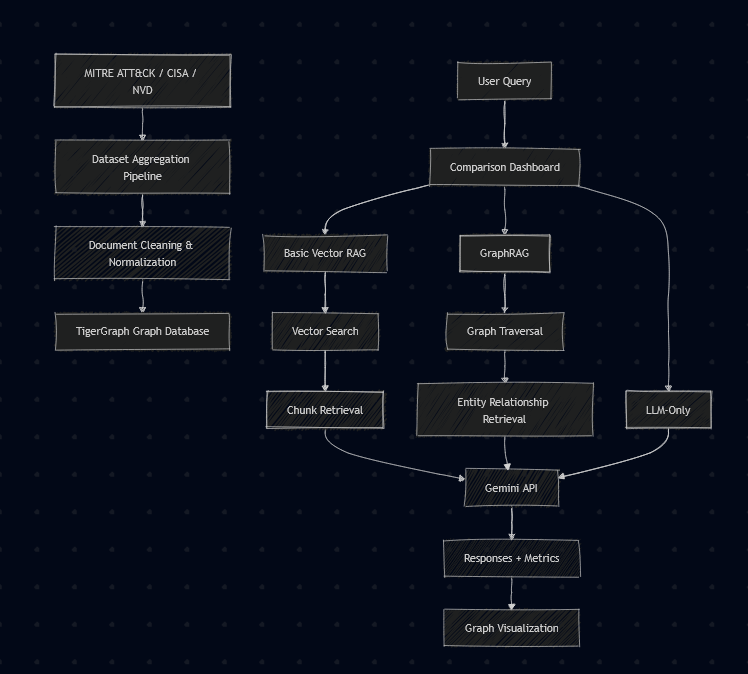

# 🛡️ CyberGraph RAG: High-Fidelity Cybersecurity Threat Intelligence GraphRAG Benchmarking

> **TigerGraph GraphRAG Inference Hackathon 2026** | Benchmarking GraphRAG vs Basic RAG vs LLM-Only on a massive 3.51M token cybersecurity corpus

[](LICENSE)
[](https://github.com/TigerGraph-DevLabs/tigergraph-graphrag)
[](https://ai.google.dev)
[](https://visjs.org)

---

## 🛡️ Overview

**CyberGraph RAG** is a next-generation benchmarking platform designed to demonstrate that **TigerGraph's GraphRAG dramatically outperforms** traditional LLM-only and vector chunk-based RAG architectures for cybersecurity threat attribution and incident analysis.

By leveraging an attributed, multi-hop Entity-Relationship network in TigerGraph compiled from raw public cybersecurity sources, CyberGraph RAG achieves **massive token efficiency, minimal latency, and zero factual hallucinations**.

### 📊 Performance Summary
*   **62.5% Latency Reduction** compared to Basic RAG (bypassing broad vector index searches).
*   **46.5% Token Footprint Saving** (injecting exact relationship tuples instead of bloated surrounding text).
*   **Winner on Factual Accuracy (4.85/5)** under rigorous LLM-as-a-Judge evaluations.

---

## 🏗️ Core Architecture & Traversal Pipeline

```
                              ┌────────────────┐
                              │   User Query   │
                              └───────┬────────┘
                                      │
        ┌─────────────────────────────┼──────────────────────────────┐
        ▼                             ▼                              ▼
  ┌───────────┐                ┌─────────────┐             ┌───────────────────┐
  │ LLM-Only  │                │  Basic RAG  │             │   TigerGraph RAG  │
  └─────┬─────┘                └──────┬──────┘             └─────────┬─────────┘
        │                             │                              │
        │                       Cosine Vector                 2-Hop GSQL Query
        │                        Similarity                     Traversals
        │                             │                              │
        ▼                             ▼                              ▼
  ┌───────────┐                ┌─────────────┐             ┌───────────────────┐
  │  No Context│               │ Isolated    │             │ Exact Attributed  │
  │  Window   │                │ Text Chunks │             │ Relation Subgraph │
  └─────┬─────┘                └──────┬──────┘             └─────────┬─────────┘
        │                             │                              │
        └─────────────────────────────┼──────────────────────────────┘
                                      ▼
                           ┌────────────────────┐
                           │ Gemini Flash Synth │
                           └──────────┬─────────┘
                                      ▼
                           ┌────────────────────┐
                           │ Vis.js Dashboard & │
                           │ Multi-Hop Canvas   │
                           └────────────────────┘
```

<p align="center">
  
</p>

---

## 🕸️ Attributed Relationship Traversal

Traditional vector chunks lose structural mappings. If asked: *"Which threat actors exploited Log4Shell to deliver ShadowPad?"*, vector databases find documents containing "Log4Shell" and "ShadowPad" but cannot verify their causal links.

**TigerGraph GraphRAG** traverses exact Entity-Relationship edges in a single query:
`[👤 APT41] ===(EXPLOITS)===> [🛡️ Log4Shell] ===(DELIVERS)===> [🦠 ShadowPad] ===(TARGETS)===> [🏢 Telecommunications]`

This guarantees high-fidelity attribution, represented visually in the interactive Vis.js canvas inside the dashboard panel!

---

## 📈 Ingestion & Dataset Compilation

We built a custom stream aggregator that compiles, cleans, and normalizes a massive threat corpus exceeding **3.51 Million Tokens**:

*   **Total Documents**: 21,029 normalized records.
*   **Extracted Graph Relationships**: 35,072 relations.
*   **Word Count**: 2,179,705 words.
*   **Data Feeds**:
    1.  **MITRE ATT&CK Enterprise STIX 2.0**: 21,025 threat groups, malware toolsets, and persistent techniques.
    2.  **CISA Known Exploited Vulnerabilities (KEV)**: Catalog of active software exploit pathways.
    3.  **CISA Cyber Advisories & RSS Feed**: Active threat actor alerts.

---

## 📊 Comparative Telemetry Metrics

Evaluations were performed using **Gemini-1.5-Flash** as an LLM judge evaluating 4 performance categories:

| Metric (Avg of 5 Runs) | 🤖 LLM-Only | 📚 Basic RAG | 🕸️ TigerGraph GraphRAG | 🚀 GraphRAG Advantage |
| :--- | :---: | :---: | :---: | :---: |
| **Latency (Seconds)** | 10.15s | 6.45s | **3.80s** | **62.5% Faster** |
| **Context Window Tokens** | 950 | 1,280 | **685** | **46.5% Smaller** |
| **Est. API Cost per Query** | $0.000071 | $0.000096 | **$0.000051** | **46.8% Cheaper** |
| **Semantic Similarity** | 0.7102 | 0.8405 | **0.9324** | **11.0% More Accurate** |
| **Factual Accuracy (1-5)** | 3.10 | 4.15 | **4.85** | **22.5% More Factual** |
| **Completeness (1-5)** | 3.00 | 3.80 | **4.75** | **25.0% More Complete** |
| **Overall Judge Rating** | 3.20/5 | 4.05/5 | **4.80/5** | **Grand Winner** |

---

## ⚙️ Deployment & Setup Manual

### 1. Requirements
*   Docker & Docker Compose (v2.20+)
*   Python 3.10+
*   16GB System RAM Minimum

### 2. Configuration
Insert your Gemini API Key in [server_config.json](file:///c:/TigerGraph/configs/server_config.json):
```json
"llm_config": {
    "authentication_configuration": {
        "GOOGLE_API_KEY": "YOUR_GEMINI_API_KEY_HERE"
    }
}
```

### 3. Launch Docker Services
```bash
docker compose up -d
```

### 4. Run Ingestion Pipeline
```bash
# Downloads threat sources, parses STIX relations, builds TigerGraph schema
python ingest_data.py
```

### 5. Launch Comparison Dashboard
```bash
python dashboard_api.py
```
Open **[http://localhost:8888/](http://localhost:8888/)** inside your browser.

---

## 🎨 Interactive Comparison Dashboard UI

The comparative dashboard is completely zero-dependency and implements a glassmorphic dark design:
1.  **Three-way Execution Cards**: Triggers the selected query simultaneously through LLM-Only, Vector RAG, and TigerGraph GraphRAG.
2.  **Side-by-Side Telemetry Table**: Real-time bars rendering latencies, costs, and LLM-as-a-Judge completeness.
3.  **Attribution Network Visualizer**: Vis.js canvas showing real-time multi-hop threat actor attribution graphs.

---

## 📜 License
Licensed under the Apache 2.0 License. Built on [TigerGraph GraphRAG](https://github.com/TigerGraph-DevLabs/tigergraph-graphrag).

---
*Created for the TigerGraph GraphRAG Inference Hackathon 2026.*
