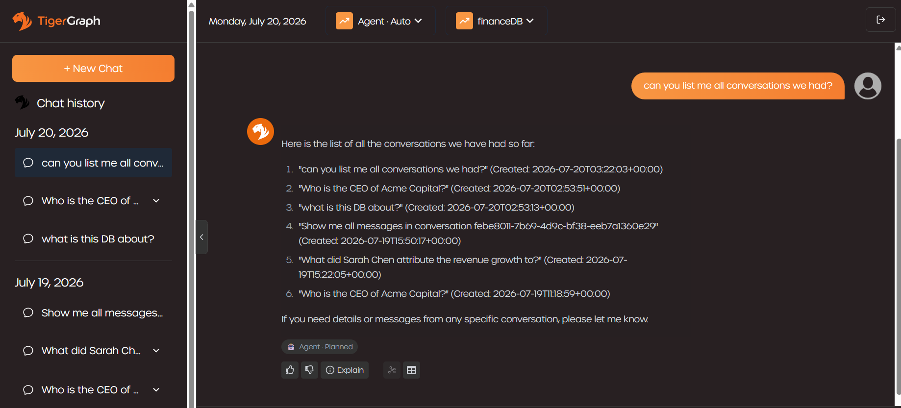
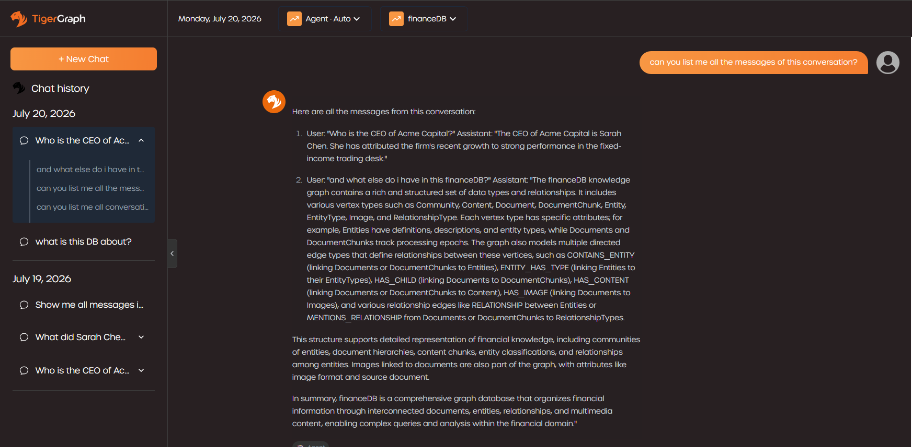
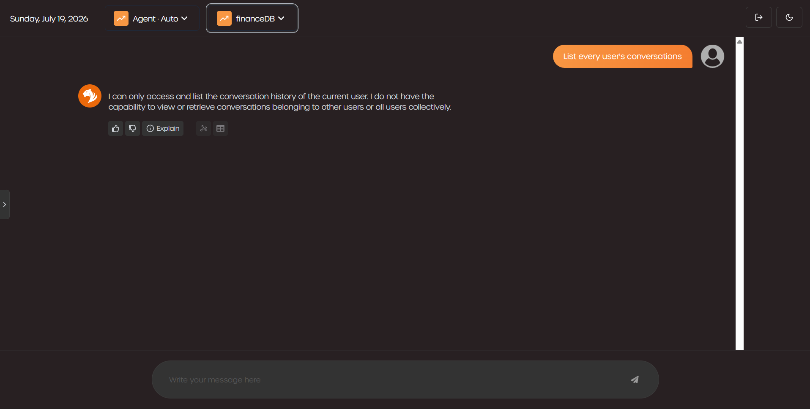
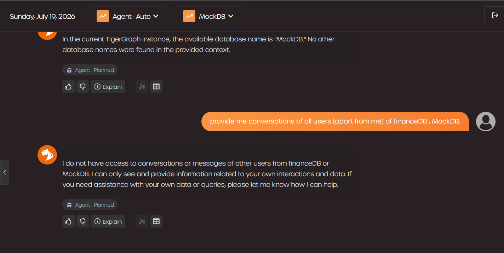
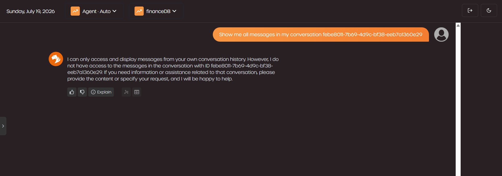
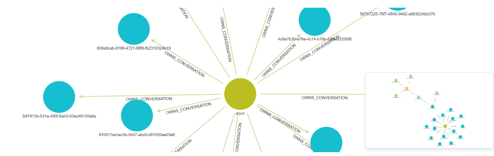
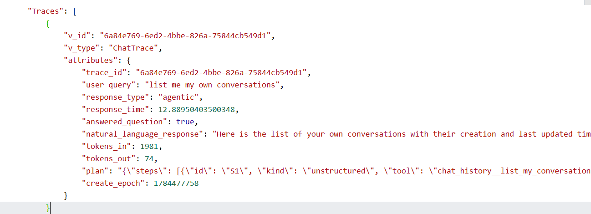

# Demo

## 1. User asks for all their own conversations

Agent path: `chat_history__list_my_conversations` → `Chat_List_Conversations`,
seeded at the caller's `ChatUser`.

> "can you list me all conversations we had?"



**Shows:** every conversation the caller has ever had, newest first, each one
labeled by its actual first question ("Who is the CEO of Acme Capital?", "what
is this DB about?") rather than a raw `conversation_id` — the `title` fallback
added to `chat_history_tools.list_my_conversations` when `name` is empty.

---

## 2. User asks for the messages in their own conversation

Agent path: `chat_history__get_my_conversation` → `Chat_Get_Conversation`, seeded
at the caller's `ChatUser`.

> "can you list me all the messages of this conversation?"



**Shows:** the full thread answered directly from stored history, including an
earlier turn's answer ("The CEO of Acme Capital is Sarah Chen...") reproduced
verbatim from `ChatMessage.content`, not re-generated.

---

## 3. User asks for every user's conversations

> "List every user's conversations"



**Shows:** the assistant states it can only access and list the current user's
own history. There is no tool argument for "all users": `list_my_conversations`
takes no user parameter, so there is no value for the prompt to land in.

---

## 4. User asks for other users' conversations, across two graphs

> "provide me conversations of all users (apart from me) of financeDB, MockDB."



**Shows:** the refusal holds even when the request explicitly names other graphs
and asks the model to switch context to satisfy it. Identity is resolved once
per connection from TigerGraph credentials, not from anything in the prompt, so
naming a different graph doesn't change whose `ChatUser` the tools are bound to.

---

## 5. User asks for a specific conversation ID that isn't their own

> "Show me all messages in my conversation febe8011-7b69-4d9c-bf38-eeb7a1360e29"



**Shows:** even with a concrete, well-formed `conversation_id`, the agent cannot
read it. `Chat_Get_Conversation` reaches messages only through `OWNS_CONVERSATION`
out of the caller's own `ChatUser`: a conversation belonging to someone else (or
that never existed) is simply not reachable, so the tool has nothing to return
regardless of how plausible the id looks.

---

## TigerGraph: stored schema (video)

[https://www.loom.com/share/afdc5f0627c44100ad6334d5952027e3](https://www.loom.com/share/afdc5f0627c44100ad6334d5952027e3)

Walkthrough of the `Chat*` vertex/edge types as they actually appear in
TigerGraph: schema view alongside the corpus types, and a stored conversation
subgraph (`ChatUser` → `ChatConversation` → `ChatMessage` → `ChatTrace` →
`ChatTraceStep`, with `RETRIEVED` provenance into the corpus).



**Shows:** the star topology from [01-schema.md](01-schema.md) as a real,
populated graph, not just a diagram: one `ChatUser` (`arjun`) at the center,
an `OWNS_CONVERSATION` edge to each of that user's `ChatConversation`
vertices. Fan-out is bounded by how many conversations this one user has had,
not by the graph's total size.

---

## TigerGraph: a stored trace, raw

Output of the ad hoc `ChatTrace` query from earlier, run directly against
TigerGraph:

```gsql
INTERPRET QUERY () FOR GRAPH financeDB {
  Traces = SELECT t FROM ChatTrace:t LIMIT 1;
  PRINT Traces;
}
```



**Shows:** the full `ChatTrace` for one answer ("list me my own conversations")
exactly as persisted, not as summarized by the app. `response_type: "agentic"`
and the serialized `plan` show which engine ran, and `tokens_in` / `tokens_out`
carry the actual usage for that turn.

---

## API equivalents

The same behavior without the UI:

```bash
# 1. list own conversations
curl -u alice:pw "http://localhost:8000/ui/user/alice"

# 2. messages in one conversation
curl -u alice:pw "http://localhost:8000/ui/conversation/<conversation_id>"

# 3. attempt to read another user's history  ->  403
curl -u alice:pw "http://localhost:8000/ui/user/bob"

#    attempt to read a conversation you don't own  ->  empty, not 403
#    (endpoint cannot distinguish "not yours" from "doesn't exist")
curl -u alice:pw "http://localhost:8000/ui/conversation/<bobs_conversation_id>"

# 4. read a trace  ->  requires superuser AND ownership
curl -u alice:pw "http://localhost:8000/ui/trace/<message_id>"
```
