# TigerGraph Chat History and Trace Persistence — Implementation Plan

## 1. Goal

Move chat history and GraphRAG execution traces from the separate SQLite-backed
Go service and local JSON files into TigerGraph, while preserving the current UI
contract and enforcing user isolation in both API and agent paths.

This plan is based on:

- the current fork at `9a00a46f0fa68c045cd4cb90689ccebd69984ba7`;
- the existing GraphRAG chat, trace, tool-registry, and GSQL installation paths;
- the assignment requirements for persistence, access control, agent
  restrictions, documentation, tests, and a demo; and
- patterns reviewed from Aryan Beluse's
  `feature/tigergraph-chat-history` reference implementation; and
- TigerGraph's own unmerged
  `GML-2070-tigergraph-as-llm-memory` branch at commit `8bf25dd`, which already
  demonstrates a repository-native Go/SQLite-to-TigerGraph cutover.

## 2. Current State Confirmed in This Fork

| Area | Current implementation | Assignment gap |
| --- | --- | --- |
| Conversations | Go service in `chat-history/`, GORM, SQLite | Data is outside TigerGraph |
| User isolation | Go routes trust the Basic-auth username; the auth middleware is a no-op | Password/token is not validated by that service |
| Chat API | `graphrag/app/routers/ui.py` proxies to `chat_history_api` | Extra service and network hop |
| Conversation continuation | History-load errors return an empty history | Unauthorized IDs can be treated as new/empty instead of failing closed |
| Message model | Python stores answer metadata; Go model omits fields such as `answered_question`, `response_type`, and `query_sources` | Persisted history loses GraphRAG response metadata |
| Traces | One JSON file per response under `/code/trace_logs` | Not persisted in TigerGraph and not durable across container recreation |
| Trace access | Superuser plus owner check | Correct direction, but file storage does not satisfy the assignment |
| Agent tools | Read-side graph tools use the logged-in application-graph connection | No principal-bound conversation tools exist |
| Compose | Root Compose builds local source but has TigerGraph commented out | A clean local checkout is not a complete reproducible stack |

Baseline note: the existing Go suite is already red before assignment changes.
`config` expects old values, a database fixture expects two conversations for a
user while the fixture creates one, and a route test assumes a missing
`server_config.json`. These should be recorded as baseline defects, then fixed
or retired when the Go service is removed.

## 3. Recommended Architecture

Use one dedicated operational graph, for example
`GraphRAGChatHistory`, rather than installing chat-history vertex types in every
customer/application graph.

```mermaid
flowchart LR
    UI["UI / API client"] --> Auth["Existing TigerGraph authentication"]
    Auth --> Principal["Resolved HistoryPrincipal"]
    Principal --> ChatAPI["GraphRAG UI router"]
    ChatAPI --> AppAgent["Agent on requested application graph"]
    ChatAPI --> Repo["Principal-bound history repository"]
    AppAgent --> OwnTools["list/get/search my conversations"]
    OwnTools --> Repo
    Repo --> ServiceConn["Internal service connection"]
    ServiceConn --> HistoryGraph["GraphRAGChatHistory operational graph"]
```



Security boundaries:

1. Authenticate the request with the existing TigerGraph authentication path.
2. Resolve the canonical TigerGraph username once and create an immutable
   `HistoryPrincipal`.
3. Do not accept `user_id` in user-facing repository or agent-tool methods.
4. Every GSQL read or mutation starts from the principal's `ChatUser` vertex and
   traverses `OWNS_CONVERSATION`; an arbitrary conversation ID alone is never
   sufficient.
5. Use a separate admin repository and admin-only endpoints for cross-user
   operations.
6. Do not grant end users access to `GraphRAGChatHistory`. The application uses
   narrowly scoped internal credentials, stored in environment secrets.
7. Keep the agent's ordinary graph tools connected only to the requested
   application graph. The operational history graph is not selectable from the
   normal graph list.

Why a dedicated graph:

- one schema and one migration path;
- no chat vertices mixed with enterprise/domain data;
- generic schema/query tools cannot accidentally discover conversations;
- retention and operational permissions are independent of customer graphs;
- a user with access to multiple application graphs sees one correctly scoped
  conversation history, with `graph_name` recorded on each conversation.

## 4. TigerGraph Data Model

### Vertices

| Vertex | Important attributes |
| --- | --- |
| `ChatUser` | `user_id` primary ID, created/updated timestamps |
| `ChatConversation` | `conversation_id` primary ID, `graph_name`, title, status, created/updated timestamps |
| `ChatMessage` | `message_id` primary ID, role, content, model, response time, feedback, comment, answer metadata, created timestamp |
| `ChatTrace` | `trace_id` primary ID, request/message ID, status, response type, elapsed time, created/expiry timestamps, bounded provenance JSON |
| `ChatTraceStep` | deterministic step ID, ordinal, step/tool type, status, duration, bounded input/output summaries, error |

### Edges

```text
ChatUser         -OWNS_CONVERSATION-> ChatConversation
ChatConversation -HAS_MESSAGE-------> ChatMessage
ChatMessage      -REPLIES_TO--------> ChatMessage
ChatMessage      -HAS_TRACE---------> ChatTrace
ChatTrace        -HAS_STEP----------> ChatTraceStep
ChatTraceStep    -DEPENDS_ON--------> ChatTraceStep
```

Do not create cross-graph `RETRIEVED` edges from traces into application
graphs. Store `graph_name`, source vertex IDs, document IDs, and citations as a
bounded provenance payload instead. This keeps the operational schema
independent and avoids multi-graph permission leakage.

IDs are generated before execution and reused for retries. This makes mutations
idempotent and lets one query safely upsert a turn after a transient failure.

## 5. Installed GSQL Query Surface

Create queries under `common/gsql/chat_history/`:

| Query | Purpose |
| --- | --- |
| `Chat_Start_Conversation` | Create owner, conversation, and first user message in one server-side operation |
| `Chat_Append_Interaction` | Verify owner and append assistant message plus trace/steps using idempotent IDs |
| `Chat_List_My_Conversations` | Owner-scoped, keyset-paginated conversation summaries |
| `Chat_Get_My_Conversation` | Owner-scoped messages with deterministic ordering and page limit |
| `Chat_Search_My_Messages` | Owner-scoped, bounded search; no whole-graph result followed by Python slicing |
| `Chat_Update_My_Feedback` | Update feedback only after owner traversal succeeds |
| `Chat_Delete_My_Conversation` | Soft-delete/tombstone an owned conversation |
| `Chat_Get_My_Trace` | Return a trace only through the owner path |
| `Chat_Get_All_Feedback_Admin` | Explicit cross-user query, available only through the admin repository |
| `Chat_Expire_Traces_Admin` | Bounded retention sweep by expiry timestamp |

Ownership checks and writes should happen in the same installed query to avoid a
read-then-write authorization race. Queries must enforce page-size, message-size,
and trace-size caps on the server side.

## 6. Python Integration

### New modules

```text
common/chat_history/
  models.py
  principal.py
  repository.py
  bootstrap.py
  retention.py
graphrag/app/tools/chat_history_tools.py
```

- `principal.py`: immutable canonical username and roles from existing
  TigerGraph authentication.
- `repository.py`: async-facing, principal-bound API. Blocking pyTigerGraph
  calls run through a bounded worker pool. Public methods never accept a user ID.
- `bootstrap.py`: idempotently create the operational graph, schema, indexes,
  queries, and least-privilege service role.
- `retention.py`: invoke a bounded installed cleanup query; expose a CLI/admin
  hook suitable for cron or a Kubernetes CronJob.
- `chat_history_tools.py`: expose only
  `list_my_conversations`, `get_my_conversation`, and `search_my_messages`.
  None of these tools accepts `user_id`, TigerGraph credentials, or a graph
  selector.

### Existing files to change

| File | Change |
| --- | --- |
| `graphrag/app/routers/ui.py` | Replace HTTP calls and trace-file I/O with the repository; return 404 for unowned conversations before invoking the agent |
| `graphrag/app/tools/graphrag_tools.py` | Add the already-bound history repository to the per-request tool context |
| `graphrag/app/tools/tool_registry.py` | Register principal-bound conversation tools |
| `graphrag/app/agent/agent.py` and agentic execution path | Inject the history repository without exposing principal selection to the LLM |
| `common/config.py` and tutorial config | Add operational graph/service settings; obtain secrets only from environment variables |
| `common/db/query_sets.py` | Add the explicit chat-history query set |
| `docker-compose.yml` | Make TigerGraph available in the source stack, add health checks, remove the Go chat-history service after parity |
| `graphrag-k8s.yml` and tutorial manifest | Remove the separate chat-history deployment and add history bootstrap/retention configuration |
| `graphrag-ui/src/pages/setup/GraphRAGConfig.tsx` | Remove the obsolete `chat_history_api` field after backend parity |

Preserve existing UI response shapes so `SideMenu.tsx`,
`ActionProvider.tsx`, `CustomChatMessage.tsx`, and `TraceLogs.tsx` require
little or no behavioral change.

## 7. Persistence Sequence Per Turn

1. Authenticate and resolve the canonical principal.
2. For an existing conversation, call an owner-scoped lookup. If no row is
   returned, stop with 404; never run the agent with empty fallback history.
3. Generate IDs and persist the user message before model execution.
4. Run GraphRAG against the requested application graph.
5. Persist the assistant message and its trace/steps before returning the
   response. Use the same IDs for retries.
6. If required persistence fails, return an observable error/reference ID and
   do not silently claim the turn was durably stored.

Trace payloads must be redacted and bounded. Do not store credentials, raw
authorization headers, full retrieved document bodies, or unrestricted tool
outputs.

## 8. Reference Implementation: Reuse and Improve

Two relevant donor implementations are available:

- Aryan Beluse's assignment branch has a useful repository abstraction,
  fine-grained trace vertices, agent-facing “my history” tools, retention, and a
  broad unit-test suite.
- TigerGraph's official `GML-2070-tigergraph-as-llm-memory` branch removes the
  Go service, introduces `common/memory/`, updates the existing UI contract, and
  includes rolling summary/short-term-memory behavior.

The official branch should be used as the primary integration reference because
it follows this repository's own conventions, but it should not be merged or
cherry-picked wholesale: it is a large, diverged change set and does not fully
satisfy this assignment's security and production requirements. In particular,
it stores memory types in each application graph, scans `{conversation.*}` and
`{message.*}`, accepts a supplied conversation ID without an owner check in the
agent-history loader, performs multi-call non-atomic upserts, silently catches
write failures, and exposes chat vertices to ordinary graph tooling.

| Reuse | Improve before adopting |
| --- | --- |
| Official `common/memory/` configuration and UI cutover patterns | Put storage behind a principal-bound repository and retain current-main behavior added after that branch diverged |
| Official rolling summary and token-budget context builder | Make summarization optional and owner-scoped; keep it separate from assignment-critical persistence |
| Python repository boundary from the assignment reference | Bind the principal once; no caller-provided user ID |
| GSQL schema/query organization | Install in one dedicated operational graph, not every knowledge graph |
| Agent tools named around “my” history | Remove user and graph selector arguments entirely |
| Trace-step persistence and retention query | Persist required traces synchronously/idempotently rather than dropping them from a best-effort queue |
| Unit tests for repository, guard, tools, and trace writer | Add real TigerGraph integration, concurrency, and API/WebSocket isolation tests |
| Feedback/admin separation | Keep admin operations in a separate repository and route surface |

Do not copy either donor's read-all-then-slice pagination, whole-type scans,
non-atomic multi-call writes, fail-open continuation behavior, or a claimed DAG
implemented only as a linear step chain.

## 9. Implementation Phases

### Phase 0 — Reproducible baseline

- Create `feature/tigergraph-chat-history` from `main`.
- Make root Compose start TigerGraph and local source images on arm64 through
  amd64 emulation.
- Add health checks and document the LLM-key setup without committing a secret.
- Record existing red tests separately from new failures.

Exit: Compose configuration is valid; TigerGraph becomes healthy; current API
health endpoint responds.

### Phase 1 — Operational graph and repository

- Add schema, indexes, installed queries, bootstrap, models, and repository.
- Add idempotency, payload bounds, pagination, and typed error mapping.
- Add SQLite export/import migration with a documented default `graph_name` for
  legacy rows.

Exit: repository integration tests persist, list, retrieve, update feedback,
delete, and expire records in TigerGraph.

### Phase 2 — API and trace cutover

- Replace Go-service proxy calls in `ui.py`.
- Replace JSON trace files with TigerGraph trace queries.
- Preserve the current REST/WebSocket payload contract.
- Fail closed for unknown/unowned conversation IDs.

Exit: container restart preserves conversation and trace data; UI history and
trace views work without the Go service.

### Phase 3 — Agent access restrictions

- Add the three principal-bound “my history” tools.
- Register them only when an authenticated history context exists.
- Add planner instructions describing allowed behavior, while keeping
  repository/GSQL ownership checks as the actual security boundary.
- Ensure the operational graph is absent from normal graph discovery.

Exit: “show all conversation history,” another username, another conversation
ID, and prompt-injection variants return only the caller's authorized data or a
not-found/refusal response.

### Phase 4 — Production hardening and cleanup

- Remove the Go chat-history service, SQLite volume/config, and file-trace path.
- Add bounded retries, timeouts, structured metrics, audit events, retention,
  and least-privilege deployment secrets.
- Add load/concurrency tests and tune GSQL queries from measured plans.

Proposed local acceptance targets, excluding LLM latency:

- first page of 50 conversations: p95 below 250 ms;
- load 200 messages: p95 below 500 ms;
- persistence overhead per completed turn: p95 below 300 ms;
- 25 concurrent users: zero cross-user rows and zero duplicate messages.

Targets should be rerun and documented against the actual submission hardware.

### Phase 5 — Submission package

- Design document with schema diagram, trust boundaries, decisions, assumptions,
  and tradeoffs.
- Setup/run/migration/rollback instructions.
- API examples for create, list, get, feedback, trace, delete, and forbidden
  cross-user access.
- Automated test report and performance results.
- Screenshots plus a short demo video covering every validation scenario.

## 10. Required Test Matrix

| Scenario | Expected result |
| --- | --- |
| User A creates and reloads a conversation | Same messages after container restart |
| User A reads User B's conversation ID | 404 with no existence leak |
| User A sends User B's ID over WebSocket | Connection/request rejected before agent execution |
| User A asks agent “show all history” | Only A's conversations |
| User A asks agent for User B by name/ID | Refusal/not found; no B content in tool result or final answer |
| Malicious stored message instructs agent to dump others | No cross-user tool capability; result remains scoped |
| Forged Basic username with bad password | Rejected by TigerGraph authentication |
| Admin feedback request | Allowed only through explicit admin route/repository |
| Duplicate retry with same IDs | One logical message/trace |
| Concurrent writes to one conversation | Stable ordering and no lost messages |
| Oversized content/trace | Rejected or safely truncated according to documented limit |
| Trace expiry sweep | Only expired traces removed; messages/conversations remain |
| TigerGraph temporarily unavailable | No silent empty history or false durability claim |

## 11. Definition of Done

- TigerGraph is the only runtime persistence store for chat history and traces.
- All user-facing reads and writes are principal-bound and fail closed.
- The agent has no callable path for selecting another user.
- The separate Go/SQLite service and local JSON trace files are absent from the
  running architecture.
- API, WebSocket, UI, integration, security, concurrency, and persistence tests
  pass.
- Setup, design, migration, tradeoffs, API examples, test evidence, and demo
  evidence are included in the repository.
